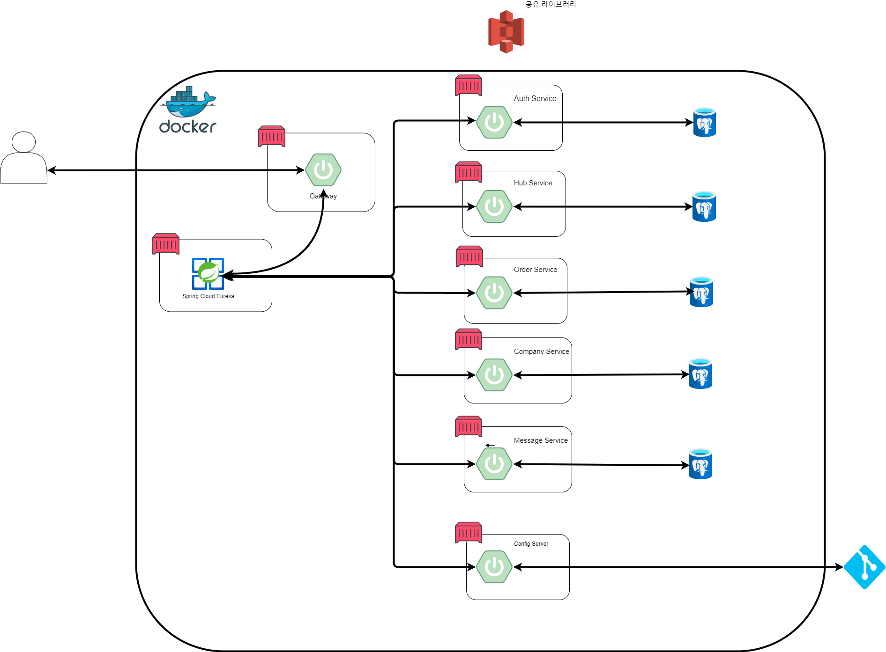

# CAGOFLOW: 물류 관리 시스템


## :mortar_board: 목차
[1. 개요](#1-개요)

[2. 주요 기능](#2-주요기능)

[3. 아키텍쳐 구조](#3-아키텍쳐-구조)

[4. ERD](#4-ERD)

[5. 문제 해결](#5-문제-해결)

[6. 프로젝트 실행 방법](#6-프로젝트-실행-방법)

## 1. 개요
### :computer: 프로젝트 개요
물류 관리 시스템(Logistics Management System) **CAGOFLOW** 은 물류 프로세스를 관리하는 시스템으로, **허브**, **업체**, **상품**, **주문** 등의 정보를 효율적으로 연동하고 검색할 수 있는 기능을 제공합니다.  
이 프로젝트는 **Spring Cloud**, **FeignClient**, **Eureka**, **Config Server**, **API Gateway** 등의 기술을 활용하여 마이크로서비스 간 독립성을 유지하며, **도메인 주도 설계**(**DDD**)를 적용하여 개발되었습니다. 또한 외부 서비스와의 데이터 통신을 원활하게 처리하는 것을 목표로 했습니다.

### 프로젝트 진행 배경 및 기간
- **개발 기간**: 8일
- **팀 구성**: 4명
- **주요 도전과제**:
  - **마이크로서비스 간 통신 문제 해결**: Spring Cloud Eureka와 FeignClient를 이용한 서비스 간 통신 구현
  - **중앙 설정 관리**: Config Server를 통해 각 마이크로서비스의 설정 정보를 중앙 관리하며, 환경별 설정 변경을 용이하게 처리.
  - **라우팅 및 인증 처리**: API Gateway를 통해 요청을 적절한 마이크로서비스로 라우팅하고, JWT 기반의 인증/인가를 처리.
  - **복잡한 검색 기능 구현**: QueryDSL을 이용해 검색 조건을 확장하고, 다양한 도메인의 데이터를 효율적으로 검색하는 시스템 구축
  - **캐싱 처리 적용**: Redis를 사용하여 허브 정보 및 경로 정보를 캐싱함으로써 API 호출 빈도를 줄이고 성능을 향상.
  - **도메인 주도 설계(DDD) 적용**: 허브, 허브 경로, 주문, 업체 등 각 도메인을 분리하고, 서비스와 리포지토리를 도메인 중심으로 설계하여 유지보수성을 향상

### 프로젝트 결과
- 각 도메인의 CRUD + Search 구현.
- **FeignClient**를 이용하여 외부 서비스와의 연동을 구현.
- **Config Server**를 통해 중앙 설정 관리를 자동화하여, 운영 환경에서의 효율성을 증대.
- **QueryDSL**을 통해 복잡한 검색 기능 조건을 처리하여 다양한 데이터를 빠르고 효율적으로 검색
- **Redis**를 이용한 캐시 기능으로 API 호출 성능을 최적화.

<hr>


### :computer: 기술 스택
#### Platform


#### SERVER

#### RDBMS


#### Application Development / Skills


-Language: JAVA 17<br>
-Framework: Spring Boot 3.3.3<br>
-DB: Postgresql, Redis<br>
-Build Tool: Gradle 8.10<br>
<hr>

### :busts_in_silhouette: 팀원 소개
- 팀장 - 김휘수 :walking:  [Github](https://github.com/notitle12)
- 팀원 - 위성구 :walking:  [Github](https://github.com/weseonggu)
- 팀원 - 이성원 :walking:  [Github](https://github.com/lsw71311)
- 팀원 - 김민철 :walking:  [Github](https://github.com/kmc198989)
<hr>

### :flags: 기본 규칙
- 계층구조 : DDD 및 클린 아키텍처


## 2. 주요기능
:arrow_right: 위성구
:
- Spring Eureka, FeignClient, Config Server, Api Gateway, Zipkin 초기 셋팅 및 실행
- AWS S3를 사용한 공유라이브러리 운영
- 깃 리포지토리를 사용하여 설정파일 관리
- Api Gateway JWT 검증 및 인가 구현
- 각 마이크로 서비스에서 프록시를 사용한 권한 정보를 사용한 확인 구현

:arrow_right: 김휘수
:
- 회원가입 및 로그인 기능 구현
- 사용자 관리 기능 구현
- 스프링 시큐리티 및 JWT 인증 시스템 구축
- 배송담당자 도메인 설계 및 구현
- 슬랙 메시지 서비스 초안 설계
- 깃 리포지토리 관리

:arrow_right: 이성원
:
- 허브, 허브 경로 도메인 구현
- QueryDsl 이용 Search 기능 구현
- Redis로 데이터 캐싱 처리 
- 슬랙 메시지 발송, 날씨 정보 기능 구현

:arrow_right: 김민철
:
- 업체 및 상품 도메인 설계 및 구현
- QueryDsl를 활용한 복잡한 검색 기능 개발
- FeignClient를 사용해 외부 서비스와의 통신 및 데이터 연동 처리

## 3. 아키텍쳐 구조


## 4. ERD


## 5. 문제 해결
:arrow_right: 발생한 문제
- 공유 라이브러리를 Maven Repository에 배포 실패
    - AWS S3를 사용하여 배포 (멀티 모듈 프로젝트로 구성으로 해결가능)

## 6. 프로젝트 실행 방법
- 프로젝트 클론 및 `docker` 설치 후 로컬 환경에서 순차적으로 실행
1. 프로젝트 클론

   ```
    git clone https://github.com/notitle12/cagoflow.git
    ```


2. 도커 컴포즈 명령어 실행

   ```
    docker-compose up -d
   ```

3. application.yml(로컬용) or application-product.yml(배포용) 작성
   <details>
   <summary>(작성 예시)</summary>

   ```yaml
   spring:
      application:
        name: HubService
      config:
        import: optional:configserver:${CONFIG_SERVER_URL}
 
     datasource:
      url: jdbc:postgresql://${host}:${port}/${database}
      username: ${username}
      password: ${password}
      driver-class-name: org.postgresql.Driver

     jpa:
       hibernate:
         ddl-auto: update                                
         dialect: org.hibernate.dialect.PostgreSQLDialect
       show-sql: true
     data:
      redis:
        host: ${REDIS_HOST}     
        port: ${REDIS_PORT}      
        password: ${REDIS_PASSWORD}                                  

     sql:
       init:
         mode: always                            
     jwt:
       secret:
         key: ${secretKey}
  
   
4. 애플리케이션 실행
5. Postman 등의 API 테스트 도구를 사용하여 API 테스트
<br>


